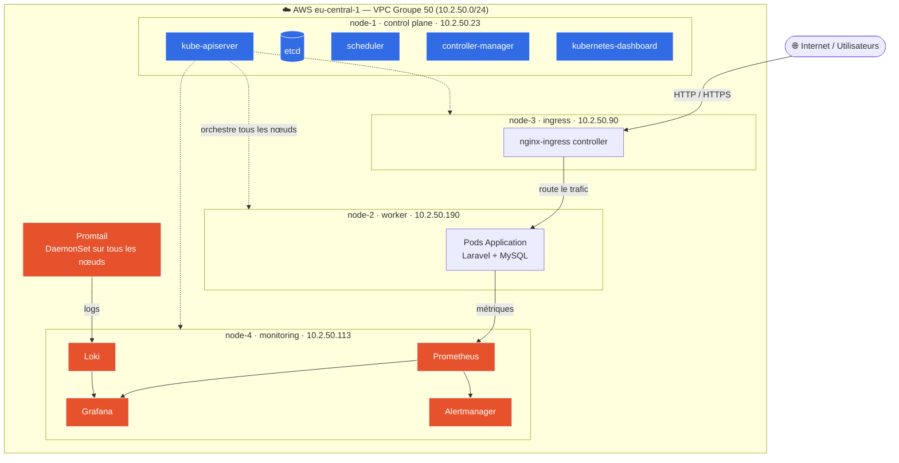

# Objectifs intermédiaires — KubeQuest Groupe 50

Document de suivi des demandes pour le point d'étape. Trois exigences à satisfaire avant la prochaine échéance.

---

## 1. Implication de chaque membre

> **Demande :** chaque membre devra avoir exécuté au moins une commande Kubernetes et manipulé les 4 VM.

### Ce que ça implique

- **Au moins une commande `kubectl`** exécutée par chaque membre (sur node-1, le control plane).
- **Manipulation des 4 VM** : s'être connecté en SSH à node-1, node-2, node-3 et node-4 et y avoir fait au moins une action.

### Comment faire (par membre)

```powershell
# 1. Se connecter en SSH à chaque VM (depuis PowerShell)
ssh -i "$env:USERPROFILE\.ssh\kubequest.pem" ec2-user@35.156.165.130   # node-1 control plane
ssh -i "$env:USERPROFILE\.ssh\kubequest.pem" ec2-user@3.72.17.106      # node-2 worker
ssh -i "$env:USERPROFILE\.ssh\kubequest.pem" ec2-user@3.123.1.25       # node-3 ingress
ssh -i "$env:USERPROFILE\.ssh\kubequest.pem" ec2-user@18.199.122.111     # node-4 monitoring
```

> Les IP publiques peuvent changer au redémarrage des VM — vérifier dans la console EC2 si une connexion échoue.

```bash
# 2. Sur node-1 : exécuter au moins une commande Kubernetes
kubectl get nodes -o wide          # voir les 4 nœuds
kubectl get pods -A                # voir tous les pods
kubectl get namespaces             # voir les namespaces

# 3. Sur chaque VM (node-2/3/4) : une commande système simple suffit pour "manipuler"
hostname
sudo systemctl status kubelet
df -h
```

### Suivi par membre

| Membre | Commande K8s exécutée | node-1 | node-2 | node-3 | node-4 |
|--------|:--------------------:|:------:|:------:|:------:|:------:|
| _Membre 1_ | ☐ | ☐ | ☐ | ☐ | ☐ |
| _Membre 2_ | ☐ | ☐ | ☐ | ☐ | ☐ |
| _Membre 3_ | ☐ | ☐ | ☐ | ☐ | ☐ |
| _Membre 4_ | ☐ | ☐ | ☐ | ☐ | ☐ |
| _Membre 5_ | ☐ | ☐ | ☐ | ☐ | ☐ |

> Astuce : faire une capture d'écran de chaque commande avec le nom/prompt du membre pour garder une trace lors de la soutenance.

---

## 2. Stack de monitoring bien avancée

> **Demande :** la stack de monitoring devra être bien avancée, même si elle n'est pas encore totalement finalisée.

### État actuel (cf. journal technique)

| Composant | Rôle | Nœud | État |
|-----------|------|------|:----:|
| **Prometheus** | Collecte des métriques | node-4 | ✅ Installé |
| **Grafana** | Visualisation / dashboards | node-4 | ✅ Installé |
| **Alertmanager** | Gestion des alertes | node-4 | ✅ Installé |
| **Loki** | Agrégation des logs | node-4 | ✅ Installé |
| **Promtail** | Envoi des logs (sur chaque nœud) | tous | ✅ Installé |

La base est en place via `kube-prometheus-stack` et `loki-stack` (Helm).

### Pour la rendre « bien avancée » (à finaliser)

- [ ] **Accéder à Grafana** et vérifier que les dashboards par défaut affichent des métriques.
  ```bash
  # Récupérer le mot de passe admin Grafana (sur node-1)
  kubectl --namespace monitoring get secrets kube-prometheus-grafana \
    -o jsonpath="{.data.admin-password}" | base64 -d ; echo
  ```
- [ ] **Exposer Grafana** via l'ingress (ou port-forward / tunnel SSH) pour y accéder depuis le navigateur.
- [ ] **Vérifier la collecte des logs** dans Loki (datasource Loki configurée dans Grafana, requête `{namespace="kube-system"}`).
- [ ] **Confirmer que Promtail tourne sur les 4 nœuds** :
  ```bash
  kubectl get pods -n monitoring -o wide | grep promtail
  ```
- [ ] **Au moins un dashboard custom** ou une vue qui montre les métriques de l'application (CPU/RAM des pods Laravel).
- [ ] (Bonus) Une **règle d'alerte** simple dans Alertmanager.

### Vérification rapide

```bash
kubectl get pods -n monitoring -o wide        # tous Running ?
kubectl get svc -n monitoring                 # services exposés
```

---

## 3. Schéma d'architecture

> **Demande :** réaliser un schéma d'architecture clair que chacun sera capable d'expliquer et de présenter.

> 📐 **Schéma complet et à jour : [`docs/schema-architecture.md`](./schema-architecture.md)**
> (vue d'ensemble, réseau Calico, flux de trafic et d'observabilité, guide de soutenance, export PNG/PDF).
> L'aperçu ci-dessous en est une version résumée.

### Vue d'ensemble du cluster



### Réseau Kubernetes (CNI)

- **CNI : Calico** — gère le réseau des pods (`pod-network-cidr 192.168.0.0/16`) et permet la communication inter-pods entre les 4 nœuds.
- Les nœuds communiquent en interne via leurs **IP privées** (`10.2.50.x`, stables).
- Les **IP publiques** ne servent qu'à l'accès SSH/admin et peuvent changer au redémarrage.

### Points à savoir expliquer en soutenance

| Élément | À pouvoir expliquer |
|---------|---------------------|
| **Control plane (node-1)** | apiserver, etcd, scheduler, controller-manager : le « cerveau » du cluster |
| **Workers (node-1, node-2)** | exécutent les pods applicatifs |
| **Ingress (node-3)** | point d'entrée unique du trafic externe → route vers les services internes |
| **Monitoring (node-4)** | Prometheus collecte, Grafana visualise, Loki centralise les logs, Promtail les envoie |
| **Calico** | le réseau qui relie les pods entre les nœuds |
| **Labels / nodeSelector** | comment on cible un nœud précis pour un déploiement |
| **Flux du trafic** | Internet → ingress → service → pod application |
| **Flux d'observabilité** | pods → Prometheus (métriques) / Promtail → Loki (logs) → Grafana (visu) |

> **Conseil :** chaque membre doit pouvoir refaire ce schéma au tableau de mémoire et décrire le chemin d'une requête HTTP depuis Internet jusqu'au pod, ainsi que le chemin d'une métrique/log jusqu'à Grafana.

---

## Checklist de synthèse

- [ ] Les 4 membres ont exécuté une commande `kubectl` (trace/capture)
- [ ] Les 4 membres se sont connectés aux 4 VM
- [ ] Stack monitoring : Grafana accessible et affiche des métriques
- [ ] Stack monitoring : Loki affiche des logs
- [ ] Schéma d'architecture finalisé et exporté (PNG/PDF)
- [ ] Chaque membre s'est entraîné à présenter le schéma
