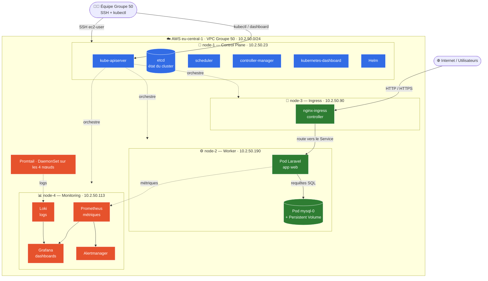
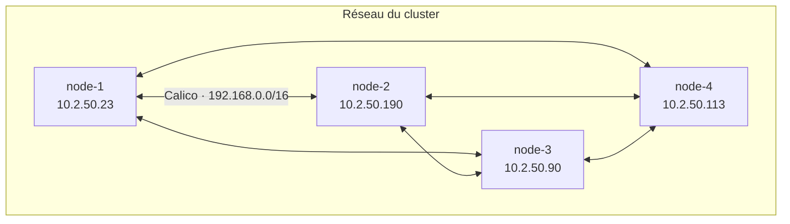

# Schéma d'architecture — KubeQuest Groupe 50

> **Objectif :** un schéma clair que **chaque membre** doit savoir expliquer et présenter.
> Il décrit le cluster Kubernetes déployé sur 4 nœuds AWS EC2 (`eu-central-1`), le chemin
> d'une requête HTTP depuis Internet et le chemin d'une métrique/log jusqu'à Grafana.

---

## 1. Vue d'ensemble du cluster



> Bleu = control plane (le « cerveau ») · Vert = trafic applicatif · Orange = observabilité.

---

## 2. Le réseau (CNI Calico)

- **CNI : Calico** — gère le réseau des pods (`--pod-network-cidr 192.168.0.0/16`) et permet
  la communication inter-pods **entre les 4 nœuds**.
- Les nœuds communiquent en interne via leurs **IP privées** (`10.2.50.x`, **stables**).
- Les **IP publiques** ne servent qu'à l'accès **SSH / admin** et **changent au redémarrage**.
- L'API server écoute sur `10.2.50.23:6443` ; les workers l'ont rejoint via `kubeadm join`.



---

## 3. Les deux flux à savoir raconter

### 🔵 Flux d'une requête HTTP (de l'utilisateur au pod)
```
Internet → nginx-ingress (node-3) → Service Kubernetes → Pod Laravel (node-2) → MySQL (node-2)
```

### 🟠 Flux d'observabilité (métrique / log jusqu'à Grafana)
```
Pods           → Prometheus (scrape des métriques, node-4) ┐
Promtail (DS)  → Loki (agrégation des logs, node-4)        ┴→ Grafana (visualisation, node-4)
                                                            Prometheus → Alertmanager (alertes)
```

---

## 4. Rôle de chaque nœud (à expliquer en soutenance)

| Nœud | Rôle | Composants | À pouvoir dire |
|------|------|------------|----------------|
| **node-1** | Control Plane | apiserver, etcd, scheduler, controller-manager, dashboard, Helm | Le « cerveau » : décide où tournent les pods et stocke l'état du cluster dans etcd |
| **node-2** | Worker | Pod Laravel + Pod MySQL (PV) | Exécute l'application ; MySQL a un volume persistant pour garder les données |
| **node-3** | Ingress | nginx-ingress controller | Point d'entrée **unique** du trafic externe → route vers les services internes |
| **node-4** | Monitoring | Prometheus, Grafana, Alertmanager, Loki | Observabilité : métriques, dashboards, alertes, logs |
| **tous** | — | Promtail (DaemonSet), Calico, kubelet | Promtail envoie les logs ; Calico relie les pods ; kubelet pilote les conteneurs |

### Notions transverses
| Élément | À pouvoir expliquer |
|---------|---------------------|
| **Labels / nodeSelector** | Comment on cible un nœud précis pour un déploiement (`node-role.kubernetes.io/...`) |
| **Helm** | Gestionnaire de paquets K8s — Laravel, ingress, monitoring installés via charts |
| **Namespaces** | `kube-system`, `ingress-nginx`, `monitoring`, `kubernetes-dashboard`, app |
| **Secrets / PV** | Credentials (DB_PASSWORD, APP_KEY) et stockage persistant de MySQL |

> **Conseil de soutenance :** chaque membre doit pouvoir **redessiner ce schéma au tableau de
> mémoire** et décrire (1) le chemin d'une requête HTTP depuis Internet jusqu'au pod Laravel,
> et (2) le chemin d'une métrique/log jusqu'à Grafana.

---

## 5. Export pour la présentation

Le diagramme est en **Mermaid** (rendu automatiquement sur GitHub/GitLab et VS Code avec
l'extension Mermaid). Pour l'exporter en image (PNG/PDF) :

- **En ligne :** copier le bloc ```mermaid``` dans <https://mermaid.live> → *Export PNG/SVG*.
- **VS Code :** extension *Markdown Preview Mermaid Support* → clic droit sur l'aperçu → exporter.
- **CLI :** `npx @mermaid-js/mermaid-cli -i docs/schema-architecture.md -o schema.png`
